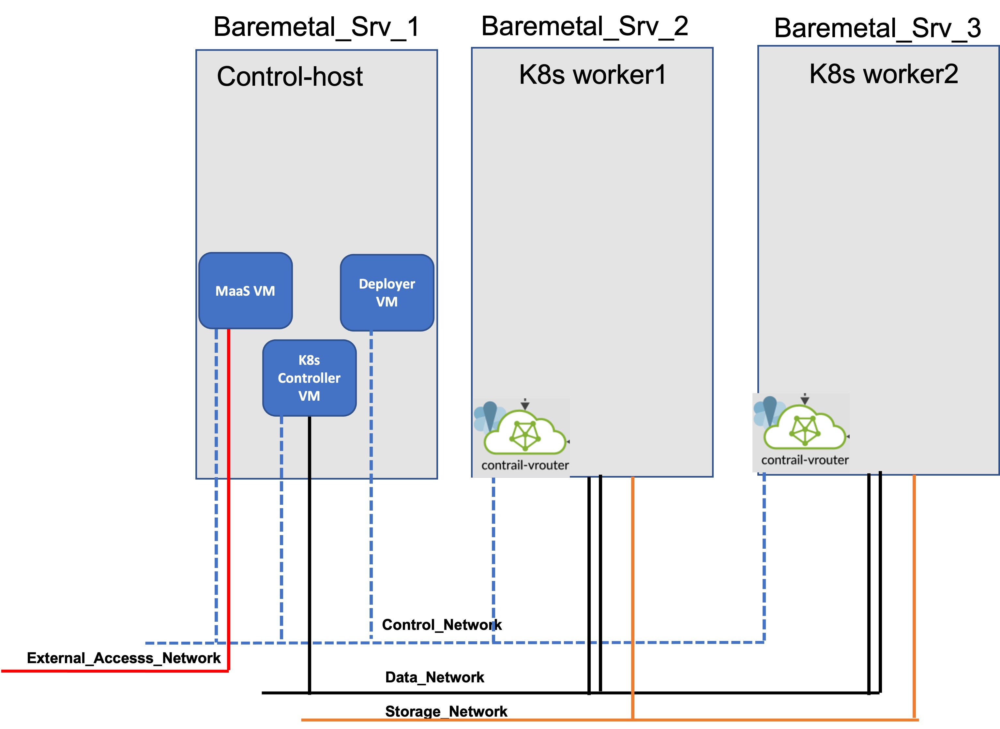

# Juniper CN2 K8s Over MaaS Managed Infrastructure 
## Problem Statement 
* Communication service providers have already started adapting Containerised Network Function (CNF).
* CNF (K8s cluster) can be spawned over Openstack VM or over bare metal servers as both approaches have their own inherited benefits / advantages. 
* E.g. If CNFs (k8s cluster) are spawned over IaaS (Openstack) VMs then life cycle Mgmt of VMs (hosting K8s cluster) is very easy due to heat / Ansible automation of Openstack resources but it also introduces performance overhead and complexities on the networking side of Openstack. 
* There is a strong advocacy from a school of thought to run CNF over bare  metals due to performance considerations and also to reduce networking complexities (discussed in the above point) but life cycle Mgmt of bare metal server is again challenging task (as BMS should be managed truly in Infrastructure as Code (IaC) style i.e. with minimal manual intervention).
## Proposed Solution
* Canonical MaaS (Metal as a Service) offers infrastructure as Code way  for life cycle Mgmt of  bare metals  and virtual  infrastructure.
  - For GUI lover, MaaS provides a nice and easy to use GUI and  for terminal lovers MaaS offers feature set rich cli commands and API calls.
* Juniper Networks have recently released Cloud native SDN Controller (CN2) which can be integrated with k8s cluster (as CNI) and it offers rich features set which are considered essentials for Telco cloud solutions.  
* In this wiki, I will discuss how to prepare MaaS managed infrastructure (bare metal and virtual) to host a k8s cluster and then bring up K8s  cluster alongwith CN2 2 (Juniper Cloud native SDN Controller).


## Implementation Details 
* It is assumed that Control-host is already bootstrapped with your favourite Linux distro and necessary setup is done to host MaaS VM.
* Creating MaaS VM
```
wget 'http://cloud-images-archive.ubuntu.com/releases/focal/release-20210921/ubuntu-20.04-server-cloudimg-amd64-disk-kvm.img'
qemu-img create -b ubuntu-20.04-server-cloudimg-amd64-disk-kvm.img  -f qcow2 -F qcow2 /var/lib/libvirt/images/maas.qcow2 200G

cat << EOF > maas_cloud_init.cfg
#cloud-config
package_upgrade: true
hostname: maas
fqdn: mass.knawaz.lab.jnpr
manage_etc_hosts: true
users:
  - name: ubuntu
    lock_passwd: false
    shell: /bin/bash
    ssh_pwauth: true
    home: /home/ubuntu
    sudo: ['ALL=(ALL) NOPASSWD:ALL']
    ssh-authorized-keys:
      - ssh-rsa "key"
  - name: contrail
    lock_passwd: false
    shell: /bin/bash
    home: /home/contrail
    ssh_pwauth: true
    sudo: ['ALL=(ALL) NOPASSWD:ALL']
    ssh-authorized-keys:
      - ssh-rsa "key"
chpasswd:
  list: |
     ubuntu:password786
  expire: False
chpasswd:
  list: |
     contrail:password786
  expire: False

write_files:
  - path:  /etc/netplan/50-cloud-init.yaml
    permissions: '0644'
    content: |
         network:
           version: 2
           renderer: networkd
           ethernets:
             ens3:
               addresses: [192.168.24.40/24]
             ens4:
               addresses: [192.168.8.40/24]
               gateway4: 192.168.8.1
               nameservers:
                 addresses: [8.8.8.8]

runcmd:
 - [sudo, ifconfig, IFNAME, up]
 - [sudo, ifconfig, IFNAME, up]
 - [sudo, netplan, generate]
 - [sudo, netplan, apply]
 - [sudo, sed ,-i, 's/PasswordAuthentication no/PasswordAuthentication yes/g', /etc/ssh/sshd_config]
 - [sudo, systemctl, restart, sshd]
 EOF 

 cloud-localds -v  mass_cloud_init.img maas_cloud_init.cfg
 
virt-install --name maas \
  --virt-type kvm --memory 4096  --vcpus 4 \
  --boot hd,menu=on \
  --disk path=maas_cloud_init.img,device=cdrom \
  --disk path=/var/lib/libvirt/images/maas.qcow2,device=disk \
  --graphics vnc \
  --os-type=Linux \
  --os-variant=ubuntu20.04 \
  --network bridge:br-ctrplane \
  --network bridge:br-external \
  --console pty,target_type=serial
```
* Wait till MaaS VM is getting prepared. 

* Set up MaaS
```
sudo snap switch --channel=latest/stable lxd
sudo snap install lxd
sudo snap refresh lxd
sudo snap install jq
sudo snap install --channel=3.2/edge maas
sudo snap install --channel=3.2/edge maas-test-db

export INTERFACE=$(ip route | grep default | cut -d ' ' -f 5)
export IP_ADDRESS=$(ip -4 addr show dev $INTERFACE | grep -oP '(?<=inet\s)\d+(\.\d+){3}')
sudo maas init region+rack --database-uri maas-test-db:/// --maas-url http://${IP_ADDRESS}:5240/MAAS
MAAS has been set up.

If you want to configure external authentication or use
MAAS with Canonical RBAC, please run

  sudo maas configauth

To create admins when not using external authentication, run
  sudo maas createadmin 

sudo maas createadmin --username admin --password admin --email admin
export APIKEY=$(sudo maas apikey --username admin)
# MAAS admin login
maas login admin 'http://localhost:5240/MAAS/' $APIKEY
echo $IP_ADDRESS
ssh-keygen
maas admin sshkeys create key="$(cat /home/contrail/.ssh/id_rsa.pub)"
```
* Open MaaS GUI and do intial setup ( OS image synch up etc)
  - Ubunut-20.4 latest stable release will be automatically synced.
  - Make sure to select and synch Centos70.
* Setup Maas Networks
```
FABRIC_ID=$(maas admin subnet read "$SUBNET" | jq -r ".vlan.fabric_id")
VLAN_TAG=$(maas admin subnet read "$SUBNET" | jq -r ".vlan.vid")
PRIMARY_RACK=$(maas admin rack-controllers read | jq -r ".[] | .system_id")
SUBNET_ID=$(maas admin subnets read | jq '.[] | select(."cidr"=="192.168.24.0/24") | .["id"]')
maas admin subnet update $SUBNET gateway_ip=192.168.24.1
maas admin subnet update $SUBNET dns=1.1.1.1
maas admin ipranges create type=reserved start_ip=192.168.24.1 end_ip=192.168.24.50
maas admin ipranges create type=dynamic start_ip=192.168.24.150 end_ip=192.168.24.200
maas admin vlan update $FABRIC_ID $VLAN_TAG dhcp_on=True primary_rack=$PRIMARY_RACK
maas admin spaces create name=oam-space
maas admin vlan update  $FABRIC_ID $VLAN_TAG space=oam-space

maas admin fabrics create name=vrouter-transport-fabric 
maas admin spaces create name=vrouter-transport-space 
FABRIC_ID=$(maas admin fabrics read | jq '.[] | select(."name"=="vrouter-transport-fabric") | .["id"]')
maas admin vlan update $FABRIC_ID 0 name=vrouter-transport-vlan mtu=9000 space=vrouter-transport-space
maas admin subnets create name=vrouter-transsport-subnet cidr=192.168.5.0/24 fabric=$FABRIC_ID
SUBNET_ID=$(maas admin subnets read | jq '.[] | select(."cidr"=="192.168.5.0/24") | .["id"]')
maas admin ipranges create type=reserved start_ip=192.168.5.100 end_ip=192.168.5.200 subnet=$SUBNET_ID
maas admin subnet update $SUBNET_ID rdns_mode=0
maas admin subnets update name=vrouter-transsport-subnet fabric=$FABRIC_ID

maas admin fabrics create name=storage-fabric 
maas admin spaces create name=storage-space 
FABRIC_ID=$(maas admin fabrics read | jq '.[] | select(."name"=="storage-fabric) | .["id"]')
maas admin vlan update $FABRIC_ID 0 name=storage-vlan mtu=9000 space=storage-space 
maas admin subnets create name=storage-subnet cidr=192.168.3.0/24 fabric=$FABRIC_ID managed=false
SUBNET_ID=$(maas admin subnets read | jq '.[] | select(."cidr"=="192.168.3.0/24") | .["id"]')
maas admin ipranges create type=reserved start_ip=192.168.3.100 end_ip=192.168.3.200 subnet=$SUBNET_ID
maas admin subnet update $SUBNET_ID rdns_mode=0
maas admin subnets update name=storage-subnet fabric=$FABRIC_ID
```
* Prepare Ubuntu-20.4.3 Image with kernel 5. 4.0-97-generic [CN2 22.1 is qualified with this particular release](https://www.juniper.net/documentation/en_US/release-independent/contrail-cloud-native/topics/reference/cloud-native-contrail-supported-platforms.pdf)

```
sudo su -
wget http://cloud-images-archive.ubuntu.com/releases/focal/release-20210819/ubuntu-20.04-server-cloudimg-amd64-root.tar.xz
mkdir /tmp/work && cd /tmp/work 
tar xfv /root/ubuntu-20.04-server-cloudimg-amd64-root.tar.xz
cat etc/os-release
mount -o bind /proc /tmp/work/proc
mount -o bind /dev /tmp/work/dev
mount -o bind /sys /tmp/work/sys
mv /tmp/work/etc/resolv.conf /tmp/work/etc/resolv.conf.bak
cp /etc/resolv.conf /tmp/work/etc/
chroot /tmp/work /bin/bash
ls boot/
apt update -y 
apt install linux-image-5.4.0-97-generic -y 
#apt install docker.io -y #Only if you are planning to use as container manager in your k8s cluster
sudo sed -i "s/GRUB_DEFAULT=0/GRUB_DEFAULT='Advanced options for Ubuntu>Ubuntu, with Linux 5.4.0-97-generic'/" /etc/default/grub
echo ubuntu 'ALL=(ALL) NOPASSWD:ALL' > /etc/sudoers.d/ubuntu
ls boot/
exit 

umount /tmp/work/proc
umount /tmp/work/dev
umount /tmp/work/sys
mv /tmp/work/etc/resolv.conf.bak /tmp/work/etc/resolv.conf
tar -czf /tmp/focal-20.04.3.tgz -C /tmp/work .
mv /tmp/focal-20.04.3.tgz /home/contrail/
exit
cd /home/contrail/
sudo chown contrail:contrail focal-20.04.3.tgz
maas admin boot-resources create name='custom/focal-20.04.3' title='Ubuntu-20.04.3' architecture='amd64/generic' filetype='tgz' content@=focal-20.04.3.tgz
```
* Prepare deployer VM  on control-host 
```
qemu-img create -f qcow2 /var/lib/libvirt/images/deployer-node.qcow2 100G
virt-install --ram 4096 --vcpus 4 --os-variant centos7.0 --disk path=/var/lib/libvirt/images/deployer-node.qcow2,device=disk,bus=virtio,format=qcow2 --graphics vnc,listen=0.0.0.0 --network bridge=br-ctrplane  --boot=network,hd --name deployer-node --cpu Nehalem,+vmx --dry-run --print-xml > /tmp/deployer-node.xml; virsh define --file /tmp/deployer-node.xml

virsh domiflist deployer-node
Interface  Type       Source     Model       MAC
-------------------------------------------------------
-          bridge     br-ctrplane virtio      52:54:00:20:25:16
```
* Comission the deployer VM on MaaS
* Make sure Cent70 image is already synched in MaaS

```
maas admin machines create \
hostname=deployer-node \
tag_names=deployer-node \
architecture="amd64/generic" \
mac_addresses=52:54:00:20:25:16 \
power_type=virsh \
power_parameters_power_id=deployer-node \
power_parameters_power_address=qemu+ssh://contrail@192.168.24.10/system \
power_parameters_power_pass=contrail123 \
osystem=centos distro_series=centos7.0
maas admin tags create name=deployer-node comment='deployer-node'
NODE_SYSID=$(maas admin machines read | jq '.[] | select(."hostname"=="deployer-node")| .["system_id"]' | tr -d '"')
maas admin tag update-nodes "deployer-node" add=$NODE_SYSID
maas admin machine deploy $NODE_SYSID osystem=centos distro_series='centos70'

(wait unitll deployer VM is deployed)
```

* Install Required Packages on deployer VM.

```
from MaaS VM
ssh  centos@192.168.24.97 (check IP of your deployer VM)
sudo su -
sudo yum update -y
sudo reboot
LC_CTYPE=en_US.UTF-8
export LC_CTYPE
sudo yum install -y git net-tools sshpass wget python3-pip python36 epel-release
sudo pip3 install --upgrade pip
sudo pip3 install ansible
ssh-keygen
```

* Copy deployer VM ssh pubkey into MaaS VM /home/contrail/deployer-node-id_rsa.pub
* Uploaed deployer VM ssh pubkey into MaaS
```
maas admin sshkeys create key="$(cat /home/contrail/deployer-node-id_rsa.pub)"
```
* Prepare K8s Controller VM on Control-host

```
for node in controller1
do 
qemu-img create -f qcow2 /var/lib/libvirt/images/${node}.qcow2 200G
virt-install --ram 16384 --vcpus 8 --os-variant centos7.0 --disk path=/var/lib/libvirt/images/${node}.qcow2,device=disk,bus=virtio,format=qcow2 --graphics vnc,listen=0.0.0.0 --network bridge=br-ctrplane  --network bridge=br-Tenant --boot=network,hd --name ${node} --cpu Nehalem,+vmx --dry-run --print-xml > /tmp/${node}.xml; virsh define --file /tmp/${node}.xml
done 

virsh domiflist controller1
Interface  Type       Source     Model       MAC
-------------------------------------------------------
-          bridge     br-ctrplane virtio      52:54:00:fb:b4:ce
-          bridge     br-Tenant  virtio      52:54:00:90:b4:bf

```
* Comission  controller1 VM into MaaS.

```
maas admin machines create \
hostname=controller1 \
tag_names=controller1 \
architecture="amd64/generic" \
mac_addresses=52:54:00:fb:b4:ce \
power_type=virsh \
power_parameters_power_id=controller1 \
power_parameters_power_address=qemu+ssh://contrail@192.168.24.10/system \
power_parameters_power_pass=contrail123 \
osystem=custom distro_series=focal-20.04.3
```
* Wait until controller1 commissioning is completed. 
* Update controller1 VM settings in MaaS.

```
maas admin tags create name=controller1 comment='controller1'
NODE_SYSID=$(maas admin machines read | jq '.[] | select(."hostname"=="controller1")| .["system_id"]' | tr -d '"')
maas admin tag update-nodes "controller1" add=$NODE_SYSID
maas admin interfaces read $NODE_SYSID | jq ".[] | {id:.id, name:.name, mac:.mac_address, vid:.vlan.vid, fabric:.vlan.fabric}" --compact-output
{"id":32,"name":"ens3","mac":"52:54:00:fb:b4:ce","vid":0,"fabric":"fabric-0"}
{"id":42,"name":"ens4","mac":"52:54:00:90:b4:bf","vid":0,"fabric":"fabric-32"}
maas admin fabrics read | jq ".[] | {name:.name, vlans:.vlans[] | {id:.id, vid:.vid}}" --compact-output
{"name":"fabric-0","vlans":{"id":5001,"vid":0}}
{"name":"fabric-1","vlans":{"id":5002,"vid":0}}
{"name":"vrouter-transport-fabric","vlans":{"id":5012,"vid":0}}
{"name":"storage-fabric","vlans":{"id":5013,"vid":0}}
maas admin interface  update $NODE_SYSID 42 vlan=5012 >/dev/null
SUBNET_ID=$(maas admin subnets read | jq '.[] | select(."cidr"=="192.168.5.0/24") | .["id"]')
IFD_ID=$(maas admin interfaces read $NODE_SYSID | jq '.[] | select(."name"=="ens4") | .["id"]')
maas admin interface link-subnet $NODE_SYSID ${IFD_ID}  subnet=${SUBNET_ID} mode=auto 
```
* Deploy  controller1 VM.
```
maas admin machine deploy $NODE_SYSID osystem=custom distro_series=focal-20.04.3
```
* Comission the worker1  into MaaS
```
maas admin machines create \
    hostname=worker1 \
    fqdn=worker1.maas \
    mac_addresses=BC:30:5B:F2:87:55 \
    architecture=amd64 \
    power_type=ipmi \
    power_parameters_power_driver=LAN_2_0 \
    power_parameters_power_user=root \
    power_parameters_power_pass=calvin \
    power_parameters_power_address=192.168.100.121
```
* Wait until worker1  commissioning is completed.
* Update worker1  settings in MaaS.
```
maas admin tags create name=worker1 comment='worker1'
NODE_SYSID=$(maas admin machines read | jq '.[] | select(."hostname"=="worker1")| .["system_id"]' | tr -d '"')
maas admin tag update-nodes "worker1" add=$NODE_SYSID
maas admin interfaces read $NODE_SYSID | jq ".[] | {id:.id, name:.name, mac:.mac_address, vid:.vlan.vid, fabric:.vlan.fabric}" --compact-output
{"id":29,"name":"eno4","mac":"bc:30:5b:f2:87:55","vid":0,"fabric":"fabric-0"}
{"id":36,"name":"eno1","mac":"bc:30:5b:f2:87:50","vid":0,"fabric":"fabric-26"}
{"id":37,"name":"eno2","mac":"bc:30:5b:f2:87:52","vid":0,"fabric":"fabric-27"}
{"id":38,"name":"eno3","mac":"bc:30:5b:f2:87:54","vid":0,"fabric":"fabric-28"}
maas admin fabrics read | jq ".[] | {name:.name, vlans:.vlans[] | {id:.id, vid:.vid}}" --compact-output
{"name":"fabric-0","vlans":{"id":5001,"vid":0}}
{"name":"fabric-1","vlans":{"id":5002,"vid":0}}
{"name":"vrouter-transport-fabric","vlans":{"id":5012,"vid":0}}
{"name":"storage-fabric","vlans":{"id":5013,"vid":0}}
maas admin interface update $NODE_SYSID 36 vlan=5012 >/dev/null
maas admin interface update $NODE_SYSID 37 vlan=5012 >/dev/null
maas admin interface update $NODE_SYSID 38 vlan=5013 >/dev/null
maas admin interfaces create-bond $NODE_SYSID name=bond0 parents=36 parents=37 bond_mode=802.3ad mtu=9000
maas admin interfaces read $NODE_SYSID | jq ".[] | {id:.id, name:.name, mac:.mac_address, vid:.vlan.vid, fabric:.vlan.fabric}" --compact-output
{"id":29,"name":"eno4","mac":"bc:30:5b:f2:87:55","vid":0,"fabric":"fabric-0"}
{"id":36,"name":"eno1","mac":"bc:30:5b:f2:87:50","vid":0,"fabric":"vrouter-transport-fabric"}
{"id":37,"name":"eno2","mac":"bc:30:5b:f2:87:52","vid":0,"fabric":"vrouter-transport-fabric"}
{"id":38,"name":"eno3","mac":"bc:30:5b:f2:87:54","vid":0,"fabric":"storage-fabric"}
{"id":43,"name":"bond0","mac":"bc:30:5b:f2:87:50","vid":0,"fabric":"vrouter-transport-fabric"}
SUBNET_ID=$(maas admin subnets read | jq '.[] | select(."cidr"=="192.168.5.0/24") | .["id"]')
IFD_ID=$(maas admin interfaces read $NODE_SYSID | jq '.[] | select(."name"=="bond0") | .["id"]')
maas admin interface link-subnet $NODE_SYSID ${IFD_ID}  subnet=${SUBNET_ID} mode=auto 
SUBNET_ID=$(maas admin subnets read | jq '.[] | select(."cidr"=="192.168.3.0/24") | .["id"]')
IFD_ID=$(maas admin interfaces read $NODE_SYSID | jq '.[] | select(."name"=="eno3") | .["id"]')
maas admin interface link-subnet $NODE_SYSID ${IFD_ID}  subnet=${SUBNET_ID} mode=auto 
```
* Deploy  worker1. 
```
maas admin machine deploy $NODE_SYSID osystem=custom distro_series=focal-20.04.3
```
* Comission  worker2  into MaaS.
```
maas admin machines create \
    hostname=worker2 \
    fqdn=worker2.maas \
    mac_addresses=BC:30:5B:F2:3F:75 \
    architecture=amd64 \
    power_type=ipmi \
    power_parameters_power_driver=LAN_2_0 \
    power_parameters_power_user=root \
    power_parameters_power_pass=calvin \
    power_parameters_power_address=192.168.100.122 \
    osystem=custom distro_series=focal-20.04.3
```
* Wait until worker2  commissioning is completed.
* Update worker1  settings in MaaS.
```
maas admin tags create name=worker2 comment='worker2'
NODE_SYSID=$(maas admin machines read | jq '.[] | select(."hostname"=="worker2")| .["system_id"]' | tr -d '"')
maas admin tag update-nodes "worker2" add=$NODE_SYSID
maas admin interfaces read $NODE_SYSID | jq ".[] | {id:.id, name:.name, mac:.mac_address, vid:.vlan.vid, fabric:.vlan.fabric}" --compact-output
{"id":30,"name":"eno4","mac":"bc:30:5b:f2:3f:75","vid":0,"fabric":"fabric-0"}
{"id":33,"name":"eno1","mac":"bc:30:5b:f2:3f:70","vid":0,"fabric":"fabric-23"}
{"id":34,"name":"eno2","mac":"bc:30:5b:f2:3f:72","vid":0,"fabric":"fabric-24"}
{"id":35,"name":"eno3","mac":"bc:30:5b:f2:3f:74","vid":0,"fabric":"fabric-25"}
maas admin fabrics read | jq ".[] | {name:.name, vlans:.vlans[] | {id:.id, vid:.vid}}" --compact-output
{"name":"fabric-0","vlans":{"id":5001,"vid":0}}
{"name":"fabric-1","vlans":{"id":5002,"vid":0}}
{"name":"vrouter-transport-fabric","vlans":{"id":5012,"vid":0}}
{"name":"storage-fabric","vlans":{"id":5013,"vid":0}}
maas admin interface  update $NODE_SYSID 33 vlan=5012 >/dev/null
maas admin interface  update $NODE_SYSID 34 vlan=5012 >/dev/null
maas admin interfaces create-bond $NODE_SYSID name=bond0 parents=33 parents=34 bond_mode=802.3ad mtu=9000
maas admin interface  update $NODE_SYSID 35 vlan=5013 >/dev/null
maas admin interfaces read $NODE_SYSID | jq ".[] | {id:.id, name:.name, mac:.mac_address, vid:.vlan.vid, fabric:.vlan.fabric}" --compact-output
{"id":30,"name":"eno4","mac":"bc:30:5b:f2:3f:75","vid":0,"fabric":"fabric-0"}
{"id":33,"name":"eno1","mac":"bc:30:5b:f2:3f:70","vid":0,"fabric":"vrouter-transport-fabric"}
{"id":34,"name":"eno2","mac":"bc:30:5b:f2:3f:72","vid":0,"fabric":"vrouter-transport-fabric"}
{"id":35,"name":"eno3","mac":"bc:30:5b:f2:3f:74","vid":0,"fabric":"storage-fabric"}
{"id":44,"name":"bond0","mac":"bc:30:5b:f2:3f:70","vid":0,"fabric":"vrouter-transport-fabric"}
SUBNET_ID=$(maas admin subnets read | jq '.[] | select(."cidr"=="192.168.5.0/24") | .["id"]')
IFD_ID=$(maas admin interfaces read $NODE_SYSID | jq '.[] | select(."name"=="bond0") | .["id"]')
maas admin interface link-subnet $NODE_SYSID ${IFD_ID}  subnet=${SUBNET_ID} mode=auto 
SUBNET_ID=$(maas admin subnets read | jq '.[] | select(."cidr"=="192.168.3.0/24") | .["id"]')
IFD_ID=$(maas admin interfaces read $NODE_SYSID | jq '.[] | select(."name"=="eno3") | .["id"]')
maas admin interface link-subnet $NODE_SYSID ${IFD_ID}  subnet=${SUBNET_ID} mode=auto 
```
* Deploy  worker2 
```
maas admin machine deploy $NODE_SYSID osystem=custom distro_series=focal-20.04.3
```
* Comission  worker3  into MaaS
```
maas admin machines create \
    hostname=worker3 \
    fqdn=worker3.maas \
    mac_addresses=BC:30:5B:F1:C2:05 \
    architecture=amd64 \
    power_type=ipmi \
    power_parameters_power_driver=LAN_2_0 \
    power_parameters_power_user=root \
    power_parameters_power_pass=calvin \
    power_parameters_power_address=192.168.100.123 \
    osystem=custom distro_series=focal-20.04.3
```
* Wait until worker2  commissioning is completed.
* Update worker1  settings in MaaS.
```
maas admin tags create name=worker3 comment='worker3'
NODE_SYSID=$(maas admin machines read | jq '.[] | select(."hostname"=="worker3")| .["system_id"]' | tr -d '"')
maas admin tag update-nodes "worker3" add=$NODE_SYSID
maas admin interfaces read $NODE_SYSID | jq ".[] | {id:.id, name:.name, mac:.mac_address, vid:.vlan.vid, fabric:.vlan.fabric}" --compact-output
{"id":31,"name":"eno4","mac":"bc:30:5b:f1:c2:05","vid":0,"fabric":"fabric-0"}
{"id":39,"name":"eno1","mac":"bc:30:5b:f1:c2:00","vid":0,"fabric":"fabric-29"}
{"id":40,"name":"eno2","mac":"bc:30:5b:f1:c2:02","vid":0,"fabric":"fabric-30"}
{"id":41,"name":"eno3","mac":"bc:30:5b:f1:c2:04","vid":0,"fabric":"fabric-31"}
maas admin fabrics read | jq ".[] | {name:.name, vlans:.vlans[] | {id:.id, vid:.vid}}" --compact-output
{"name":"fabric-0","vlans":{"id":5001,"vid":0}}
{"name":"fabric-1","vlans":{"id":5002,"vid":0}}
{"name":"vrouter-transport-fabric","vlans":{"id":5012,"vid":0}}
{"name":"storage-fabric","vlans":{"id":5013,"vid":0}}
maas admin interface  update $NODE_SYSID 39 vlan=5012 >/dev/null
maas admin interface  update $NODE_SYSID 40 vlan=5012 >/dev/null
maas admin interfaces create-bond $NODE_SYSID name=bond0 parents=39 parents=40 bond_mode=802.3ad mtu=9000
maas admin interface  update $NODE_SYSID 41 vlan=5013 >/dev/null
maas admin interfaces read $NODE_SYSID | jq ".[] | {id:.id, name:.name, mac:.mac_address, vid:.vlan.vid, fabric:.vlan.fabric}" --compact-output
{"id":31,"name":"eno4","mac":"bc:30:5b:f1:c2:05","vid":0,"fabric":"fabric-0"}
{"id":39,"name":"eno1","mac":"bc:30:5b:f1:c2:00","vid":0,"fabric":"vrouter-transport-fabric"}
{"id":40,"name":"eno2","mac":"bc:30:5b:f1:c2:02","vid":0,"fabric":"vrouter-transport-fabric"}
{"id":41,"name":"eno3","mac":"bc:30:5b:f1:c2:04","vid":0,"fabric":"storage-fabric"}
{"id":45,"name":"bond0","mac":"bc:30:5b:f1:c2:00","vid":0,"fabric":"vrouter-transport-fabric"}
SUBNET_ID=$(maas admin subnets read | jq '.[] | select(."cidr"=="192.168.5.0/24") | .["id"]')
IFD_ID=$(maas admin interfaces read $NODE_SYSID | jq '.[] | select(."name"=="bond0") | .["id"]')
maas admin interface link-subnet $NODE_SYSID ${IFD_ID}  subnet=${SUBNET_ID} mode=auto 
SUBNET_ID=$(maas admin subnets read | jq '.[] | select(."cidr"=="192.168.3.0/24") | .["id"]')
IFD_ID=$(maas admin interfaces read $NODE_SYSID | jq '.[] | select(."name"=="eno3") | .["id"]')
maas admin interface link-subnet $NODE_SYSID ${IFD_ID}  subnet=${SUBNET_ID} mode=auto 
```
* Deploy  worker3 
```
maas admin machine deploy $NODE_SYSID osystem=custom distro_series=focal-20.04.3
```
* Prepare k8s deployment in deployer VM
* Referece guide can be found on [Create a Kubernetes Cluster](https://www.juniper.net/documentation/us/en/software/cn-cloud-native22/cn-cloud-native-k8s-install-and-lcm/topics/task/cn-cloud-native-k8s-create-kubernetes-cluster.html)
```
cd $HOME
git clone https://github.com/kubernetes-sigs/kubespray.git
cd kubespray
sed -i '/ansible==5.7.1/#ansible==5.7.1/ requirements.txt
sed -i '/ansible-core==2.12.5/#ansible-core==2.12.5/ requirements.txt
sudo pip3 install -r requirements.txt
cp -rfp inventory/sample inventory/testcluster
cd inventory/testcluster
cp inventory.ini hosts.ini
vim host.ini (adjust as your deployment, host.ini from my setup is avilable with this wiki)
```
* Review the k8s-cluster.yml file and ammend it if any changes required.
```
cd $HOME/kubespray/inventory/testcluster/group_vars/k8s_cluster
vim k8s-cluster.yml
```
* Sample  k8s-cluster.yml file from my setup is available with this wiki.
* Initiate the k8s cluster deployment.
```
export ANSIBLE_HOST_KEY_CHECKING=False
cd $HOME/kubespray
ansible -i inventory/testcluster/hosts.ini -m ping all
ansible-playbook -i inventory/testcluster/hosts.ini cluster.yml -u ubuntu --become 
```
* Montior the Deployment

```
kubectl get nodes
kubectl get pods -A -o wide
```
* All pods should have a STATUS of Running except for the DNS pods. The DNS pods do not come up because there is no networking. This is what we expect
* Prepare CN2 deployer.
* I have executed following sequence from controller1 node as root user, but it is doable from deployer node as well provided kubectl is installed and credentials are imported. 
* Download CN2 [manifest](https://support.juniper.net/support/downloads/?p=contrail#sw)
```
from controller1 node
sudo su -
tar -zxvf contrail-manifests-k8s-22.1.0.93.tgz
cd /root/contrail-manifests-k8s/single_cluster/
```
* Ammend the deployer.yml as per [reference guide](https://www.juniper.net/documentation/us/en/software/cn-cloud-native22/cn-cloud-native-k8s-install-and-lcm/topics/topic-map/cn-cloud-native-k8s-install-single-cluster-one-net.html#task_e15_krd_qjb)
* Sample deployer.yaml from my setup is avilable with this wiki.
* Kicking off CN2 deployment. 
```
from controller1 node
sudo su -
cd /root/contrail-manifests-k8s/single_cluster/
kubectl apply -f deployer.yml
```
## Verification

* All nodes should be in ready state and all pods should be in running status

```
kubectl get nodes -o wide
NAME          STATUS   ROLES                  AGE   VERSION   INTERNAL-IP      EXTERNAL-IP   OS-IMAGE             KERNEL-VERSION     CONTAINER-RUNTIME
controller1   Ready    control-plane,master   15h   v1.23.5   192.168.24.97    <none>        Ubuntu 20.04.3 LTS   5.4.0-97-generic   containerd://1.6.8
worker1       Ready    <none>                 15h   v1.23.5   192.168.24.107   <none>        Ubuntu 20.04.3 LTS   5.4.0-97-generic   containerd://1.6.8
worker2       Ready    <none>                 15h   v1.23.5   192.168.24.108   <none>        Ubuntu 20.04.3 LTS   5.4.0-97-generic   containerd://1.6.8

kubectl get pods -o wide --all-namespaces
NAMESPACE         NAME                                        READY   STATUS    RESTARTS   AGE   IP               NODE          NOMINATED NODE   READINESS GATES
contrail-deploy   contrail-k8s-deployer-858bb45dd7-nxwrk      1/1     Running   0          14h   192.168.24.97    controller1   <none>           <none>
contrail-system   contrail-k8s-apiserver-745c6c7977-thg9b     1/1     Running   0          14h   192.168.24.97    controller1   <none>           <none>
contrail-system   contrail-k8s-controller-7777877b44-c2ln4    1/1     Running   0          14h   192.168.24.97    controller1   <none>           <none>
contrail          contrail-control-0                          2/2     Running   0          14h   192.168.24.97    controller1   <none>           <none>
contrail          contrail-k8s-kubemanager-869dc9c546-sq86j   1/1     Running   0          14h   192.168.24.97    controller1   <none>           <none>
contrail          contrail-vrouter-masters-f6qxs              3/3     Running   0          14h   192.168.24.97    controller1   <none>           <none>
contrail          contrail-vrouter-nodes-szdc6                3/3     Running   0          14h   192.168.24.107   worker1       <none>           <none>
contrail          contrail-vrouter-nodes-z65hr                3/3     Running   0          14h   192.168.24.108   worker2       <none>           <none>
kube-system       coredns-59d6b54d97-h56lp                    1/1     Running   0          14h   10.233.64.2      controller1   <none>           <none>
kube-system       coredns-59d6b54d97-vwrnv                    1/1     Running   0          15h   10.233.66.0      worker2       <none>           <none>
kube-system       dns-autoscaler-78676459f6-kn8mx             1/1     Running   0          15h   10.233.66.1      worker2       <none>           <none>
kube-system       kube-apiserver-controller1                  1/1     Running   1          15h   192.168.24.97    controller1   <none>           <none>
kube-system       kube-controller-manager-controller1         1/1     Running   1          15h   192.168.24.97    controller1   <none>           <none>
kube-system       kube-proxy-brm4j                            1/1     Running   0          15h   192.168.24.97    controller1   <none>           <none>
kube-system       kube-proxy-pdn7w                            1/1     Running   0          15h   192.168.24.108   worker2       <none>           <none>
kube-system       kube-proxy-rf5qr                            1/1     Running   0          15h   192.168.24.107   worker1       <none>           <none>
kube-system       kube-scheduler-controller1                  1/1     Running   1          15h   192.168.24.97    controller1   <none>           <none>
kube-system       nginx-proxy-worker1                         1/1     Running   0          15h   192.168.24.107   worker1       <none>           <none>
kube-system       nginx-proxy-worker2                         1/1     Running   0          15h   192.168.24.108   worker2       <none>           <none>
kube-system       nodelocaldns-cflck                          1/1     Running   0          15h   192.168.24.97    controller1   <none>           <none>
kube-system       nodelocaldns-pm5bw                          1/1     Running   0          15h   192.168.24.108   worker2       <none>           <none>
kube-system       nodelocaldns-v98vj                          1/1     Running   0          15h   192.168.24.107   worker1       <none>           <none
```

## What's Next
* If you look at my lab diagram it shows multiple NICs for worker nodes but I have used single NIC for K8s deployment i.e Shared network deployment (using same NIC for Data and Control plane traffic).
* In next go I will deploy CN2 DPDK vrouter while using seprate NICs for Control and Data Plane Network. 
* I also have added Storage Network and will deliberate how to integrate Ceph storage in this solution and  to use the dedicated storage network for Ceph access from Controller and worker nodes.

# Conclusion
* Multiple options are available for life cycle mgmt of k8s cluster.
* Life cycle mgmt for bare metal infrastructure hosting k8s cluster is an  important factor and should follow Infrastrutre as Code (IaC) model.


   

